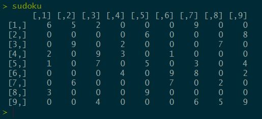

# Sudoku game with R
Sudoku is a classical  logical game based on combinatorial number replacement puzzle.
Objective is to to fill 9x9 matrix with digitcs so that each column, each row, and each box (3x3 subgrid) of nine contain all of the digits from 1 to 9.


## R code

R code consists of couple helper functions and matrix for the sudoku to be solved.




## Cloning the repository
You can follow the steps below to clone the repository. 
```
git clone -n https://github.com/tomaztk/Sudoku_game_with_R.git
```

## Contributors and co-authors 

Thanks to these wonderful community people making this classical game in R better. Contributions of any kind is highly appreciated!


## License
These samples and templates are all licensed under the MIT license.

## Questions
Email questions to: tomaztsql@gmail.com
